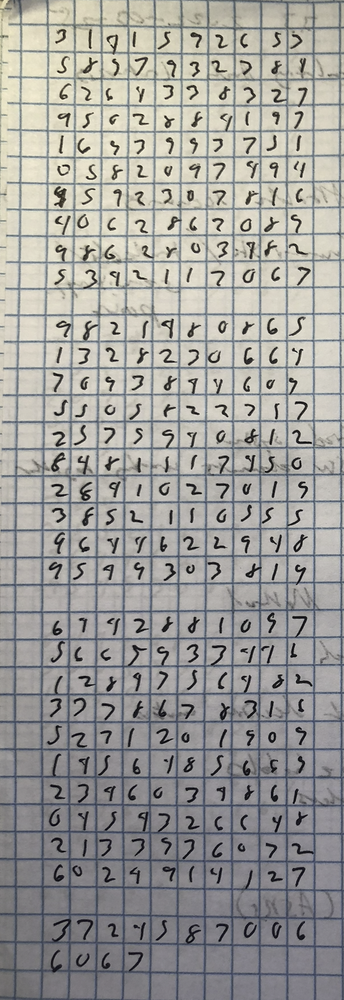

# Algorithms
> You have to let it all go, Neo - fear, doubt, and disbelief...  **Free your mind.**
>
[-Morpheus (The Matrix, 1999)](https://en.wikipedia.org/wiki/The_Matrix)

Images can be imprinted upon the mind as a "feeling" which can be placed into the hippocampus (the mind's "long-term memory store") to later been "seen" upon demand by the prefrontal cortex (the mind's "smart manager") and expressed via the basal ganglia (the mind's "stupid repeater"); and thus, it is possible to beneficially self-modify our minds by iteratively improving our observational opportunities for growth and adapting accordingly with metacognition.  Yet, some tasks and settings preclude people from receiving self-correcting information which would reveal the suboptimal nature of their decisions ([the Dunning-Kruger effect](https://en.wikipedia.org/wiki/Dunning-Kruger_effect)).  Double-ignorance is similar to a dependency loop: how can we find an entry point within a bidirectionally cyclic graph?

## The First 314 Digits of PI

Stored in the hippocampus as three matrices of `10` rows and `10` columns, followed by one row of `10`, followed by one row of `4`.



```
3141592653
5897932384
6264338327
9502884197
1693993751
0582097494
4592307816
4062862089
9862803482
5342117067

9821480865
1328230664
7093844609
5505822317
2535940812
8481117450
2841027019
3852110555
9644622948
9549303819

6442881097
5665933446
1284756482
3378678316
5271201909
1456485669
2346034861
0454326648
2133936072
6024914127

3724587006
6063
```

## Download Instructions
Use git to clone this repository and submodules from the command line:

```
    git clone git@github.com:claytonjwong/Algorithms.git
    cd Algorithms
    git submodule update --init --recursive
```

Update existing submodules from the command line:

```
    git pull --recurse-submodules
```

## Jedi Mind Tricks
* [Mini Habits](https://claytonjwong.github.io/mini-habits/)
* [Learning How to Learn](https://claytonjwong.github.io/learning/)
* [How to be an Imperfectionist](https://claytonjwong.github.io/imperfectionist/)
* [Speed Reading with the Right Brain](https://claytonjwong.github.io/reading/)
* [Science of Well-Being](https://claytonjwong.github.io/wellness/)
* [A Liberated Mind: How to Pivot Toward What Matters](https://claytonjwong.github.io/ACT/)
* [The Socratic Method](https://claytonjwong.github.io/socratic-method/)
* The Obstacle is the Way: The Timeless Art of Turning Trials into Triumph
* Ego is the Enemy
* Courage is Calling: Fortune Favors the Brave
* [Thanks for the Feedback](https://claytonjwong.github.io/feedback/)

## Algorithms
* [Algorithms Illuminated](https://www.github.com/claytonjwong/Algorithms-Illuminated/)
* [Algorithms Specialization by Stanford University](https://claytonjwong.github.io/Algorithms-Stanford/)
* [Algorithms and Data Structures by UC San Diego](https://claytonjwong.github.io/Algorithms-UCSanDiego/)
* [Algorithms for DNA Sequencing by Johns Hopkins University](https://claytonjwong.github.io/Algorithms-DNA-Sequencing/)
* [Competitive Programmer's Core Skills by Saint Petersburg State University](https://claytonjwong.github.io/competitive-programming/)
* [Bioinformatics](https://github.com/claytonjwong/algo-bioinformatics)

## Recursion
* [Master Theorem](https://claytonjwong.github.io/Master-Theorem/)
* [The ART of Dynamic Programming](https://claytonjwong.github.io/The-ART-of-Dynamic-Programming/)
* [The Art and Theory of Dynamic Programming](https://www.academia.edu/8817530/The_Art_and_Theory_of_Dynamic_Programming)

## Projects
* [Rubik's Cube](https://claytonjwong.github.io/rubiks-cube/)
* [Towers of Hanoi](https://claytonjwong.github.io/Towers-Of-Hanoi/)

## Competitive Programming
## [LeetCode.com](https://leetcode.com/claytonjwong/)
* [KT](https://github.com/claytonjwong/leetcode-kt)
* [JS](https://github.com/claytonjwong/leetcode-js)
* [PY](https://github.com/claytonjwong/leetcode-py)
* [C++](https://github.com/claytonjwong/leetcode)

## [AdventOfCode.com](https://www.adventofcode.com/)

* [2020 - PY](https://claytonjwong.github.io/advent-of-code/2020/)
* [2019 - JS](https://claytonjwong.github.io/advent-of-code/2019/)
* [2018 - C++](https://github.com/claytonjwong/advent-of-code/tree/master/2018)
* [2017 - C++](https://github.com/claytonjwong/advent-of-code/tree/master/2017)

## Resources
* [Algorithms: Dasgupta-Papadimitriou-Vazirani ( 2006 )](https://github.com/claytonjwong/Algorithms-Stanford/tree/master/documentation/Dasgupta-Papadimitriou-Vazirani.pdf)
* [Algorithms and Data Structures: Mehlhorn-Sanders ( 2007 )](https://github.com/claytonjwong/Algorithms-Stanford/tree/master/documentation/Mehlhorn-Sanders-Toolbox.pdf)
* [Introduction to Algorithms: Cormen-Leiserson-Rivest-Stein ( 2009 )](https://en.wikipedia.org/wiki/Introduction_to_Algorithms)
* [Discrete Probability](https://en.wikibooks.org/wiki/High_School_Mathematics_Extensions/Discrete_Probability)
* [Mathematical Proofs](https://en.wikibooks.org/wiki/High_School_Mathematics_Extensions/Mathematical_Proofs)

## Beneficial Songs
* [Rise Up](https://www.youtube.com/watch?v=x12CWu3V0lg)
* [Whatever It Takes](https://www.youtube.com/watch?v=gOsM-DYAEhY)
* [Try To Be Best](https://www.youtube.com/watch?v=oomCIXGzsR0)
* [Try Everything](https://www.youtube.com/watch?v=c6rP-YP4c5I)
* [Get Back Up Again](https://www.youtube.com/watch?v=IFuFm0m2wj0)
